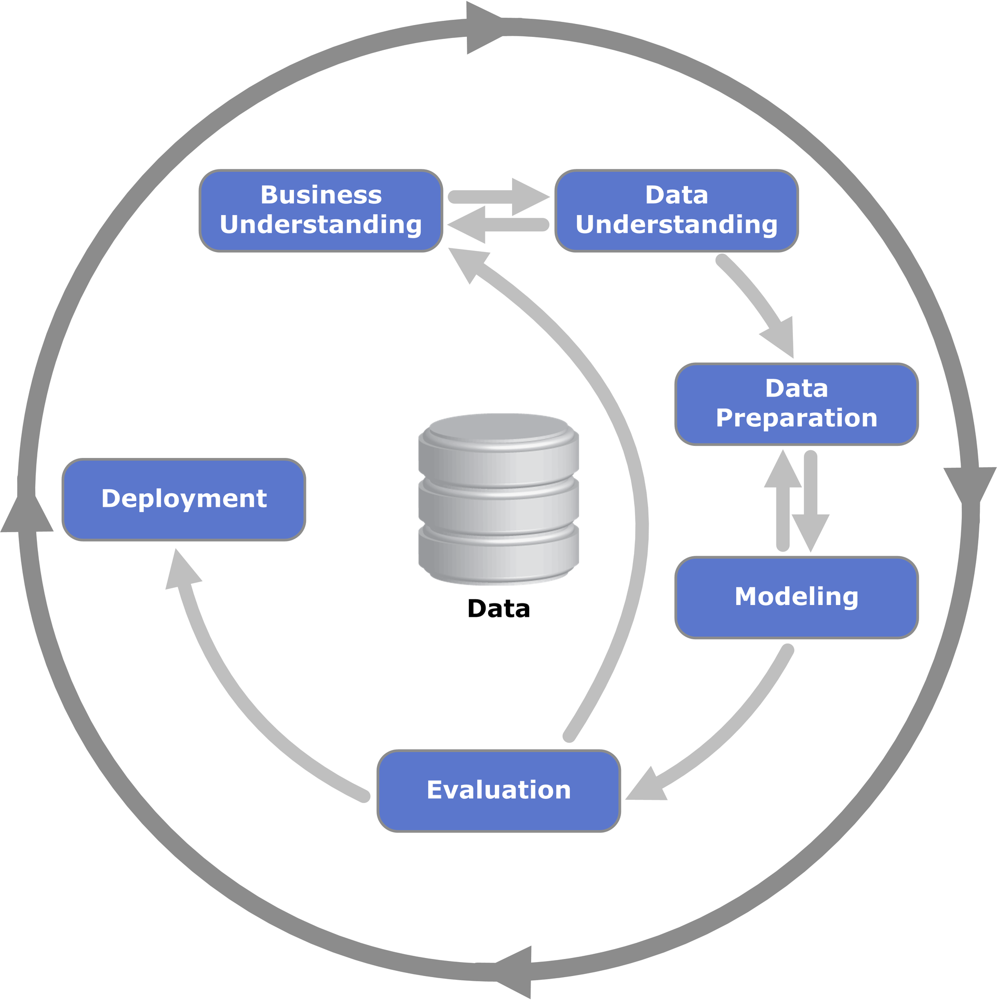
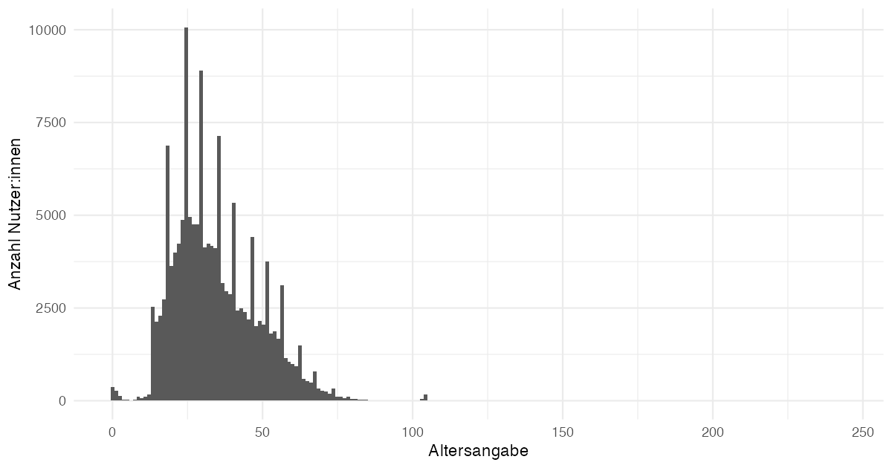
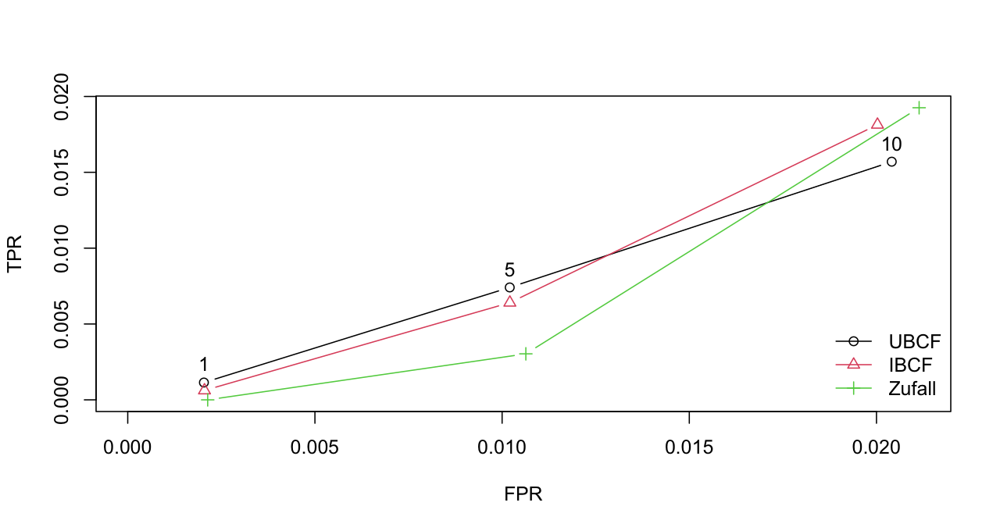
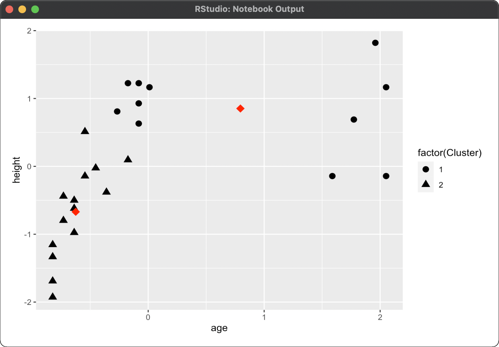
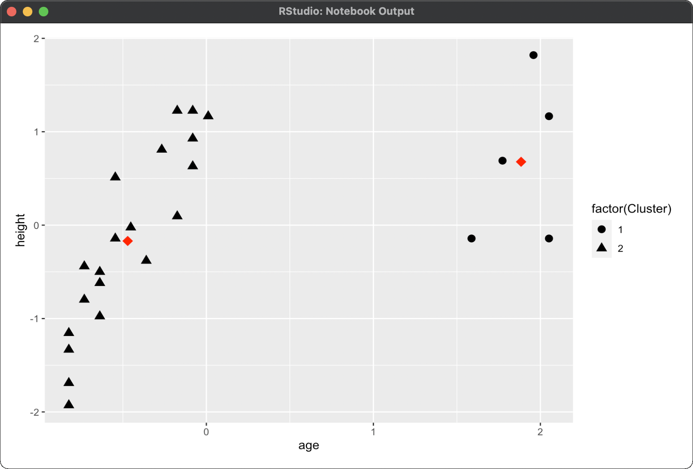
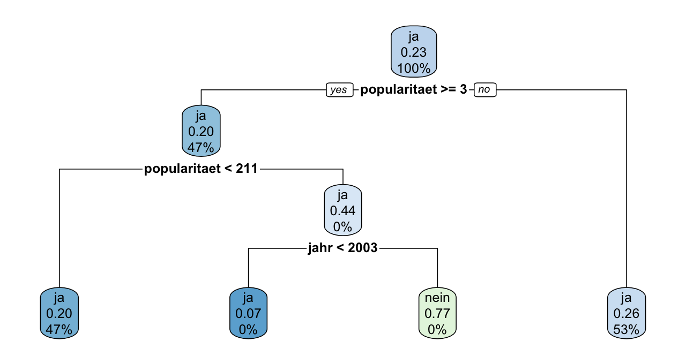
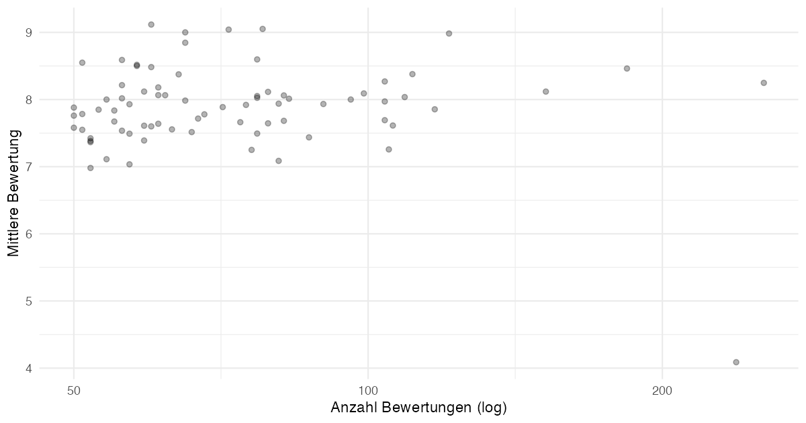
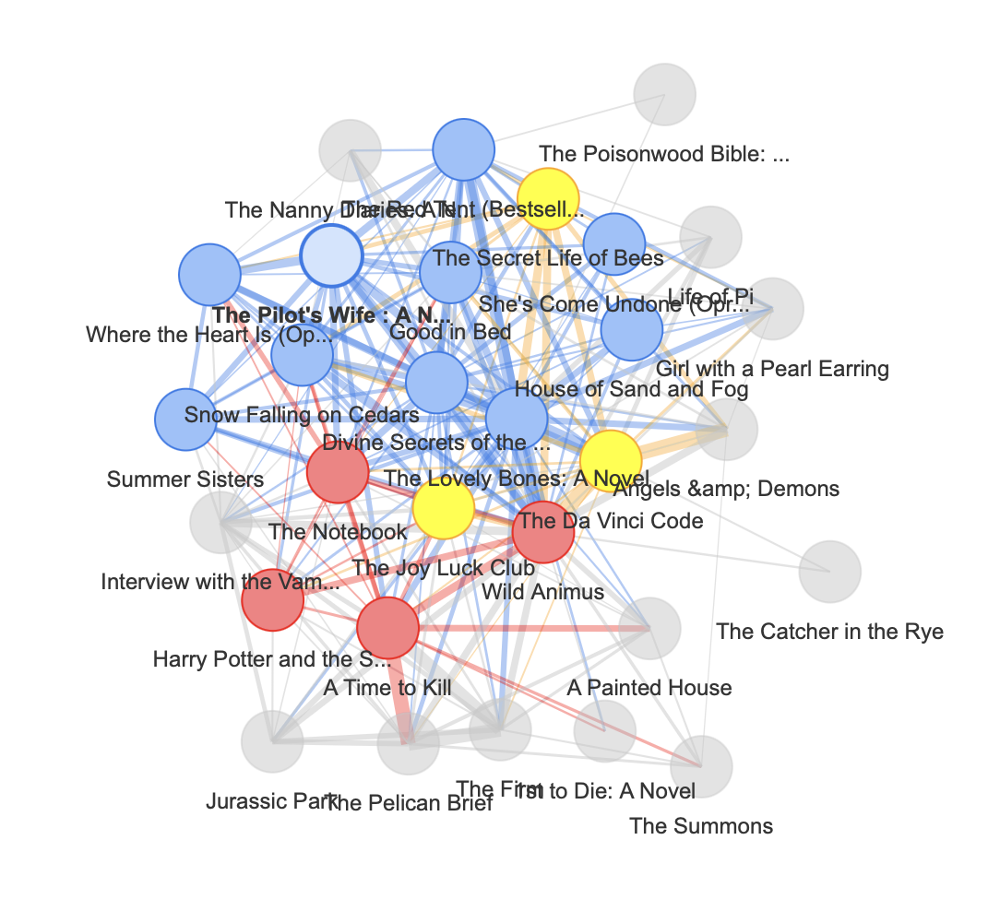

```{r}
#| include: false
library(arules)
library(tidyverse)
```


## Ziele dieser Konsultation

- Offene Fragen zu den Materialien klären
- Die Begriffe sauber sortieren: KI, ML, LLMs, Data Science, Data Mining
- Data Mining mit dem BookCrossing-Datensatz

## Ablauf heute

| Block | Inhalt               |
|-------|----------------------|
| 1     | Begriffe & Konzepte  |
| Pause |                      |
| 2     | Hands-on Data Mining |

## Logistik

- **Fragen:** Bitte unterbrechen Sie mich für Fragen
- **Kontakt:** [tom\@alby.de](mailto:tom@alby.de)
- Material auf GitHub (Link im Moodle)

# Konzepte klären

## Womit starten wir?

- Welche Materialien haben Sie durchgearbeitet?
- Wo hakte es?

## Die Begriffe sortiert

- **KI:** Maschinen verhalten sich intelligent.
- **Machine Learning:** Teilmenge der KI, Systeme lernen selbstständig aus Daten.
- **LLMs:** Spezialform von ML, Modelle, die menschliche Sprache "verstehen" und generieren.
- **Data Mining:** Mustererkennung in strukturierten Daten.
- **Text Mining:** Mustererkennung in unstrukturierten Texten
- **Data Science:** Die Disziplin drumherum, von der Analyse bis zum Business-Einsatz.

## Standortbestimmung

- Wo begegnen / nutzen Sie KI / Data Mining heute schon?
- Wo würden Sie gerne KI / Data Mining nutzen?
- Welche KI-Versprechen hören Bibliotheken aktuell von Anbietern?

## Diskussion

- Mandl: Data Mining = strukturierte Daten, Text Mining = unstrukturierte Texte
- Wo liegen Bibliothekskataloge auf diesem Spektrum?
- Metadaten vs. Abstracts vs. Volltexte

## Der BookCrossing-Datensatz

- 2004 von Cai-Nicolas Ziegler aus der BookCrossing-Community gecrawlt
- Demos in diesem Deck nutzen ein Teilsample (\~494.000 Bewertungen):

## Der BookCrossing-Datensatz

| Datei           | Inhalt                           | Größe                   |
|-------------------|----------------------------------|-------------------|
| BX-Users        | User-ID, Location, Age           | \~278.000 Nutzer:innen  |
| BX-Books        | ISBN, Titel, Autor, Jahr, Verlag | \~271.000 Bücher        |
| BX-Book-Ratings | User-ID, ISBN, Rating 0–10       | \~1,15 Mio. Bewertungen |

## CRISP-DM



## Was stimmt im BookCrossings-Daten nicht?

- **Ratings:** 0 ist kein Bewertung, sondern **implizit**.
- **Users:** Age von 0 bis 244, viele NULL; Location als Freitext
- **Books:** mehrere ISBNs pro Werk (Auflagen), Erscheinungsjahre 0 und 2050
- **Technisch:** Semikolon-CSV, Latin-1, kaputte Escapes
- **Sparsity:** 1,15 Mio. Ratings bei 278k × 271k möglichen Paaren

## Visualisierung als erster Schritt in der Datenanalyse



## Exkurs: Was heißt Sparsity?

- Die Tabelle ist fast leer.
- Beispiel: eine Tabelle mit einer Zeile pro Nutzer:in und einer Spalte pro Buch, in den Zellen die Bewertungen
- 278.000 × 271.000 ≈ **75 Milliarden Zellen** — gefüllt sind \~1 Mio., also **0,002 %**
- Selbst die eifrigste Viel-Leserin füllt ihre Zeile zu weniger als 0,1 %

## Sparsity: die Folgen

- Selbst populäre Buchpaare tauchen nur in einem Promille der Warenkörbe auf — Schwellenwerte müssen winzig sein
- Zwei beliebige Nutzer:innen haben oft **kein einziges** gemeinsames Buch — Ähnlichkeit lässt sich gar nicht berechnen
- Muster entstehen erst, weil sich Millionen fast leerer Zeilen überlagern

## FRBR und Sparsity

- Sparsity entsteht, weil Nutzer:innen zu wenige Bücher bewertet haben.
- FRBR: dasselbe Werk taucht unter vielen ISBNs auf: Sparsity wird verschärft, weil wenige Bewertungen für ein Werk auf mehrere ISBNs verteilt werden
- BookCrossing kennt **nur ISBNs = Manifestationen** — das Werk müssen wir per Data Mining rekonstruieren
- Genau das macht Record Linkage (später)

# Data Mining-Ansätze für den BookCrossing-Datensatz

## Software

- R: Programmiersprache und -umgebung von Statistikern für Statistiker, Open Source
- RStudio: Integrierte Entwicklungsumgebung, kostenlos für viele Zwecke
- Notebook im GitHub, kann mit der Software genutzt werden
- Was ist ein Notebook?

## Wie würden Sie es lösen: Empfehlungen?

- Sie haben drei Tabellen: Nutzer:innen, Bücher, Bewertungen
- Aufgabe: Schlagen Sie Leser:innen passende Bücher vor
- **Wie würden Sie vorgehen? Welche Spalten brauchen Sie?**

## Warum nicht einfach die Bestseller empfehlen?

- Stellen Sie sich vor, im Supermarkt hängt ein Plakat: „Kaufen Sie doch mal Milch, Toilettenpapier und Butter!"
- Stimmt statistisch — das kauft fast jeder. Aber hilft es *Ihnen*?
- Genauso nützlich ist die Bestsellerliste als Empfehlung für die einzelne Leserin
- **Häufig heißt nicht relevant** — gesucht ist, was zu *diesem* Bücherregal passt

## Die Idee: Zusammenhänge statt Häufigkeit

- Angenommen, in 10 % aller Einkäufe liegt Bier, in 7 % liegen Kartoffelchips
- Jetzt schauen wir nur in die Bierkäufe:
  - Liegen auch dort in 7 % Chips → kein Zusammenhang, Chips sind einfach Chips
  - Liegen dort in **25 %** Chips → da ist etwas! Eine **Assoziation**

## Vom Supermarkt zu BookCrossing

- Wer Buch A im Regal hat — welche Bücher stehen bei diesen Leser:innen überdurchschnittlich oft daneben?
- Vorsicht: Eine Regel ist keine Kausalität (auch wenn Wein → Korkenzieher das vermuten lässt)

## Von Hand: 8 Leser:innen — je ein „Bücherregal"

```{r}
#| include: false
mini <- list(
  u1 = c("Da Vinci Code", "Angels & Demons"),
  u2 = c("Da Vinci Code", "Angels & Demons", "Life of Pi"),
  u3 = c("Da Vinci Code", "Life of Pi"),
  u4 = c("Angels & Demons", "Da Vinci Code"),
  u5 = c("Life of Pi"),
  u6 = c("Da Vinci Code"),
  u7 = c("Angels & Demons", "Da Vinci Code"),
  u8 = c("Life of Pi", "Bridget Jones")
)
```

```{r}
#| echo: false
tibble(
  `Leser:in` = paste0("U", 1:8),
  `Bücherregal` = c(
    "Da Vinci Code, Angels & Demons",
    "Da Vinci Code, Angels & Demons, Life of Pi",
    "Da Vinci Code, Life of Pi",
    "Angels & Demons, Da Vinci Code",
    "Life of Pi",
    "Da Vinci Code",
    "Angels & Demons, Da Vinci Code",
    "Life of Pi, Bridget Jones"
  )
) %>% knitr::kable()
```

## Support: Lohnt sich die Regel überhaupt?

- Wir zählen einfach: In wie vielen der 8 Warenkörbe liegen *Angels & Demons* **und** *Da Vinci Code* zusammen?
- In 4 von 8 → Support = **0,5**
- Was fast nie vorkommt, ist kein Muster, sondern Zufall — und geschäftlich uninteressant

## Konfidenz: Wie verlässlich ist die Regel?

- Jetzt schauen wir nur in die Warenkörbe mit *Angels & Demons* — das sind 4
- In allen 4 liegt auch der *Da Vinci Code* → Konfidenz = **1,0**
- Sprechweise: „Der Da Vinci Code taucht in 100 % der Fälle auf, in denen Angels & Demons auftaucht"
- Achtung: Hat nichts mit den Konfidenzintervallen aus der Statistik zu tun!

## Lift: Mehr als nur Popularität?

- Der *Da Vinci Code* liegt sowieso in 6 von 8 Warenkörben — 75 %, ein Bestseller
- Bei den *Angels-&-Demons*-Leser:innen sind es aber 100 %
- 100 % geteilt durch 75 % = Lift **1,33**: ein Drittel häufiger, als wenn die beiden Bücher nichts miteinander zu tun hätten
- **Der Lift ist unser Bestseller-Detektor:** Bei „kaufen sowieso alle" bleibt er bei 1

## Dasselbe mit arules

```{r}
#| echo: true
#| output: false
trans_mini <- as(mini, "transactions")
regeln_mini <- apriori(trans_mini,
  parameter = list(supp = 0.3, conf = 0.7, minlen = 2),
  control = list(verbose = FALSE))
```

```{r}
#| echo: false
DATAFRAME(regeln_mini) %>%
  arrange(desc(lift)) %>%
  transmute(Wenn = LHS, Dann = RHS,
            Support = round(support, 2),
            Konfidenz = round(confidence, 2),
            Lift = round(lift, 2)) %>%
  knitr::kable()
```

## Warum heißt das eigentlich „Apriori"?

- Eigentlich müsste man jede Buchkombination mit jeder vergleichen — bei 271.000 Büchern hoffnungslos
- Der Trick (Agrawal et al., 1994): **Was selten ist, fliegt früh raus** — samt aller Warenkörbe und Kombinationen, in denen es steckt
- Die Logik dahinter: Wenn schon {A, B} selten ist, kann {A, B, C} unmöglich häufig sein
- Das weiß der Algorithmus *a priori* — vor dem Nachzählen

## Jetzt mit den echten Daten

```{r}
#| echo: false
#| output: false
library(tidyverse)
books <- read_delim("../statistik/data/Archiv/BX-Books.csv",
    delim = ";", escape_double = FALSE,
    col_types = cols(`Year-Of-Publication` = col_integer(),
        `Image-URL-S` = col_skip(), `Image-URL-M` = col_skip(),
        `Image-URL-L` = col_skip()),
    trim_ws = TRUE, locale = locale(encoding = "Latin1")) %>%
  distinct(ISBN, .keep_all = TRUE)

ratings <- read_delim("../statistik/data/Archiv/BX-Book-Ratings.csv",
    delim = ";", escape_double = FALSE,
    col_types = cols(`Book-Rating` = col_integer()),
    trim_ws = TRUE, locale = locale(encoding = "Latin1"))

bx <- ratings %>% inner_join(books, by = "ISBN")

koerbe <- split(bx$`Book-Title`, bx$`User-ID`)
koerbe <- lapply(koerbe, unique)
koerbe <- koerbe[lengths(koerbe) >= 2]
trans  <- as(koerbe, "transactions")
```

- Transaktion = alle Bücher, die ein:e Nutzer:in erfasst hat (auch implizite 0-Ratings: erfasst = gelesen)
- `r format(nrow(ratings), big.mark = ".")` Bewertungen → `r format(length(koerbe), big.mark = ".")` Warenkörbe mit mindestens 2 Büchern
- Vorarbeit aus der Datenqualitäts-Übung: ISBN-Dubletten entfernt, ein "Warenkorb" pro Person dedupliziert

## Welche Bücher dominieren?

```{r}
#| fig-height: 4
itemFrequencyPlot(trans, topN = 10, cex.names = 0.6,
                  main = "Häufigste Bücher im BookCrossing-Datensatz")
```

## Apriori laufen lassen

```{r}
#| echo: true
#| output: false
regeln <- apriori(trans,
  parameter = list(supp = 0.001, conf = 0.5, minlen = 2),
  control = list(verbose = FALSE))
```

- Drei Zeilen Code, `r format(length(regeln), big.mark = ".")` gefundene Regeln — schauen wir uns die stärksten an

## Die stärksten Regeln

```{r}
#| echo: false
DATAFRAME(head(sort(regeln, by = "lift"), 3)) %>%
  transmute(`Wenn gelesen ...` = str_trunc(as.character(LHS), 55),
            `... dann auch` = str_trunc(as.character(RHS), 35),
            Konfidenz = round(confidence, 2),
            Lift = round(lift, 0),
            Personen = count) %>%
  knitr::kable(row.names = FALSE)
```

## Was sehen wir?

- Buchserien dominieren: Die Green-Mile-Bände sagen einander mit Konfidenz 1,0 voraus (Lift \> 500)
- Der Algorithmus „kennt" weder Serien noch Genres — er findet sie in den Co-Occurrences
- Aber: Die Top-Regel stützt sich auf 19 Personen — **wie belastbar ist das?**
- Und: Hoher Support ≠ gute Empfehlung

## Wild Animus: populär, aber zusammenhanglos

```{r}
#| echo: true
itemFrequency(trans)["Wild Animus"]
length(subset(regeln, lhs %in% "Wild Animus" & size(lhs) == 1))
```

- In fast 5 % aller Körbe — und trotzdem folgt aus „hat Wild Animus" *allein* keine einzige verlässliche Regel
- **Popularität ist kein Muster**

## Empfehlung konkret

```{r}
#| echo: true
#| output: false
empf <- subset(regeln, lhs %pin% "Harry Potter")
```

```{r}
#| echo: false
DATAFRAME(head(sort(empf, by = "confidence"), 3)) %>%
  transmute(`Wer das gelesen hat ...` = str_trunc(as.character(LHS), 55),
            `... bekommt empfohlen` = str_trunc(as.character(RHS), 35),
            Konfidenz = round(confidence, 2)) %>%
  knitr::kable(row.names = FALSE)
```

## Stellschrauben & Stolpersteine

- `supp = 0.001` — bei 271.000 Büchern muss der Support winzig sein (Sparsity), sonst findet Apriori nichts
- Zu winzig → Regeln auf einer Handvoll Fälle; `count` immer mitlesen
- Ohne `unique()` je Warenkorb und ISBN-Deduplizierung: Empfehlung = dasselbe Buch in anderer Auflage
- Komplette Pipeline zum Nachrechnen: → Notebook

# Über Apriori hinaus: die Data-Mining-Werkzeugkiste

## Eine Landkarte der Verfahren

- **Unüberwacht** — Muster finden, ohne dass jemand die „richtige Antwort" vorgibt:
  - Assoziationsregeln, Clustering, Netzwerkanalyse, Anomalieerkennung
- **Überwacht** — aus Beispielen mit bekanntem Ergebnis lernen:
  - Klassifikation, Recommender mit Bewertungen
- Alle folgenden Verfahren laufen auf demselben BookCrossing-Datensatz

## Wie würden Sie es lösen: persönliche Empfehlungen?

- Apriori liefert eine Regel für alle — jetzt soll es persönlich werden
- Aufgabe: Eine Empfehlung speziell für Nutzerin 198711, nur aus den Bewertungsdaten
- **Wie würden Sie ihren Geschmack erfassen — und mit wem vergleichen?**

## Collaborative Filtering: Wie macht Spotify das?

- Die Charts gefallen Ihnen nicht, Spotify trifft dennoch Ihren Geschmack. Wie?
- Nicht über den Inhalt: Der Algorithmus weiß nicht, was ein Genre ist
- **Geschmacksnachbarn**: Menschen, die bisher ähnlich bewertet haben wie Sie
- Was die mochten und Sie noch nicht kennen — das ist Ihre Empfehlung
- Unterschied zu Apriori: nicht *eine* Regel für alle, sondern eine **persönliche** Liste

## Collaborative Filtering: Zwei Varianten

- **UBCF — User-Based:** Finde Nutzer:innen, die ähnlich bewertet haben wie du → übernimm ihre Favoriten
- **IBCF — Item-Based:** Finde Bücher, die ähnlich bewertet wurden wie deine Favoriten → empfehle die nächsten
- Beide nutzen dieselbe Tabelle — UBCF vergleicht Zeilen, IBCF vergleicht Spalten
- Welcher Ansatz besser ist, hängt vom Datensatz ab — deshalb testen wir beide

## Collaborative Filtering: Wie es funktioniert (UBCF)

- Die große Tabelle: eine Zeile pro Nutzer:in, eine Spalte pro Buch, in den Zellen die Noten
- Schritt 1: Finde die Zeilen, die Ihrer Zeile am ähnlichsten sind
- Schritt 2: Was steht dort gut bewertet, fehlt aber bei Ihnen? → Empfehlung
- Hier schlägt die Sparsity zu: fast leere Zeilen kann man nicht vergleichen
- Deshalb erst eindampfen — übrig bleiben 743 aktive Leser:innen × 477 populäre Bücher

## Collaborative Filtering: Wie es funktioniert (IBCF)

- Dieselbe Tabelle — aber jetzt vergleichen wir **Spalten** (Bücher), nicht Zeilen
- Schritt 1: Berechne für jedes Buchpaar eine Ähnlichkeit — Bücher sind ähnlich, wenn ihr gemeinsames Bewertungsprofil übereinstimmt
- Schritt 2: Empfohlen werden die Bücher, die Ihren Favoriten am ähnlichsten sind — die Sie aber noch nicht bewertet haben
- Kein Blick auf andere Nutzer:innen — nur auf die Ähnlichkeit zwischen Büchern

## IBCF: Ein Beispiel

| | Da Vinci | Angels | Life of Pi | Harry Potter |
|---|---|---|---|---|
| A | 8 | 9 | — | 7 |
| B | 7 | 8 | 6 | — |
| C | **9** | ? | — | **8** |
| D | — | — | 9 | — |
| E | 6 | 7 | — | 6 |

- „Da Vinci" und „Angels": überall wo beide bewertet wurden, liegen die Zahlen nah beieinander → hohe Ähnlichkeit
- „Da Vinci" und „Life of Pi": nur B hat beide bewertet → kaum Überlappung → niedrige Ähnlichkeit
- Nutzerin C hat Da Vinci (9) gut gefunden → Angels wird empfohlen, weil es Da Vinci am ähnlichsten ist
- Kein Schritt hat gefragt: „Wer hat ähnlichen Geschmack wie C?" — das wäre UBCF

## Collaborative Filtering: Funktioniert das wirklich?

- Der Test funktioniert wie in der Schule: Wir verstecken einen Teil der Bewertungen und lassen das Verfahren raten
- Ergebnis: deutlich besser als Zufallsempfehlungen (ROC-Kurve → Notebook)
- Die Empfehlungslisten sind in sich stimmig — obwohl niemand dem System je „Genre" beigebracht hat
- Schwäche: Wer noch nichts bewertet hat, bekommt nichts; was neu ist, wird nicht empfohlen (**Cold Start**)

## Wie liest man das Testergebnis?

- Drei Kandidaten treten an:
  - **UBCF** — empfiehlt über ähnliche *Personen* („Geschmacksnachbarn")
  - **IBCF** — empfiehlt über ähnliche *Bücher* (Bücher, die von denselben Menschen ähnlich bewertet wurden)
  - **RANDOM** — würfelt (unsere Untergrenze)
- Zwei Achsen:
  - Nach oben (**TPR**): Wie viele der versteckten Lieblingsbücher wurden gefunden?
  - Nach rechts (**FPR**): Wie viele Empfehlungen waren daneben?

## Der Test im Bild



## Was bedeuten die Abkürzungen?

- **ROC** — Receiver Operating Characteristic: wie gut trennt ein Verfahren Treffer von Fehlern?
- **TPR** — True Positive Rate: Anteil der Lieblingsbücher, die das System gefunden hat
- **FPR** — False Positive Rate: Anteil der Empfehlungen, die daneben lagen
- Eine perfekte Kurve schmiegt sich an die obere linke Ecke — viel TPR, kaum FPR

## Was sehen wir im Bild?

- UBCF und IBCF liegen bei wenigen Empfehlungen (N=1, 5) über der Diagonale — sie treffen öfter als Zufall
- Zufall liegt darunter: er empfiehlt gleichmäßig, die Testbücher sind aber nicht gleichmäßig verteilt
- UBCF und IBCF greifen bevorzugt auf viel bewertete Bücher zurück — und treffen den Test-Pool deshalb öfter
- Alle Werte sind winzig (max. \~2 %): selbst das beste Verfahren findet nur einen Bruchteil der versteckten Bücher — das ist Sparsity

## Wie würden Sie es lösen: Lesertypen?

- Aufgabe: Beschreiben Sie die Nutzerschaft in einer Handvoll Typen — ohne dass jemand die Typen vorgibt
- **Welche Merkmale aus den Tabellen würden Sie heranziehen? Woran erkennt man „ähnliche" Nutzer:innen?**

## Clustering: Lesertypen finden

- Idee: **Gruppiere Ähnliches, ohne vorher Gruppen festzulegen**
- Denken Sie an eine Schule: 800 Schulkinder (10–20 Jahre), 100 Lehrkräfte (30–65 Jahre)
- Ein Algorithmus, der das Konzept „Lehrkraft" gar nicht kennt, findet die zwei Gruppen trotzdem — allein über die Altersabstände
- Mehr braucht es nicht: Abstände messen, Nahes zusammenfassen

## k-Means: So funktioniert der Algorithmus

- **Schritt 1:** Setze k Zufallspunkte ins Koordinatensystem — die ersten Centroids
- **Schritt 2:** Weise jeden Datenpunkt dem nächsten Centroid zu
- **Schritt 3:** Verschiebe jeden Centroid in die Mitte seiner Gruppe
- **Schritt 4:** Wiederhole Schritte 2–3, bis sich nichts mehr ändert
- Das k muss man selbst wählen — k=4 heißt: „Ich erwarte vier Lesertypen"

## Zufälliges Platzieren der Centroids



## Neuberechnung der Abstände



## Clustering: Welche Lesertypen stecken in BookCrossing?

- Wir beschreiben jede:n Nutzer:in mit vier Zahlen: Wie viele Bücher? Wie oft bewertet? Wie streng? Wie schwankend?
- k-means findet vier Gruppen (Zahlen → Notebook):
  - Die **Vielleser:innen** — 83 Bücher im Regal (Median)
  - Die **Wohlwollenden** — bewerten fast alles, Durchschnittsnote 7,8
  - Die **Strengen** — Note 6,5 bei der größten Schwankung
  - Die **stillen Sammler:innen** — erfassen viel, bewerten kaum
- Die Namen stammen von mir, nicht vom Algorithmus — **deuten muss der Mensch**

## Wie würden Sie es lösen: Wird das Buch gefallen?

- Aufgabe: Sagen Sie vorher, ob eine Leserin ein Buch mit 7+ benoten wird
- Zur Verfügung stehen nur: ihr Alter, das Erscheinungsjahr, die Popularität des Buchs
- **Reicht das? Was würden Sie daraus ableiten — und was fehlt Ihnen?**

## Klassifikation: Woher weiß der Spamfilter, was Spam ist?

- Er hat tausende Mails gesehen, die Menschen vorher als Spam markiert haben
- Das ist **überwachtes Lernen**: aus Fällen mit bekannter Antwort lernen, neue Fälle vorhersagen
- Der Unterschied zum Clustering: Dort sucht der Algorithmus selbst nach Gruppen — hier geben wir die „richtige Antwort" zum Üben vor
- Unsere Frage an BookCrossing: **Wird diese Leserin dieses Buch mögen?**

## Klassifikation: Der Entscheidungsbaum als Auskunftsgespräch

- Das Modell stellt nacheinander Ja/Nein-Fragen: Ist das Buch populär? Ist die Leserin über 30?
- Jede Frage teilt die Fälle weiter auf — am Ende jedes Astes steht eine Vorhersage
- Gelernt werden die Fragen aus den Beispielen: Der Baum wählt selbst, welche Frage am besten trennt
- Großer Vorteil gegenüber „Black Boxes": Man kann den Baum **lesen** und Betroffenen erklären

## Entscheidungsbaum: Wie wählt der Algo die Frage?

- Bei jeder Verzweigung probiert der Algorithmus **alle möglichen Schnitte** durch die Daten
- Gewählt wird der Schnitt, der die entstehenden Gruppen am **reinsten** macht — möglichst alle „mag" auf einer Seite, alle „mag nicht" auf der anderen
- Maß dafür: der Gini-Index — je homogener eine Gruppe, desto besser
- Der Baum wächst Ast für Ast, bis jede Gruppe rein genug ist oder zu wenige Fälle enthält

## So sieht unser Baum aus



## Klassifikation: Die 77-Prozent-Falle

- Unser Baum liegt in 77 % der Fälle richtig. Klingt ordentlich?
- Der Haken: Er sagt fast immer „mag es" — von 4.384 „Gefällt nicht"-Fällen erkennt er ganze **37**
- Ein Modell, das stur *immer* „mag es" sagt, käme auf fast dieselbe Quote
- **Bei schiefen Klassen lügt die Trefferquote** — darum immer in die Confusion Matrix schauen
- (Kommt Ihnen bekannt vor? Häufig ≠ relevant — dasselbe Problem wie bei den Bestsellern)

## Wie würden Sie es lösen: Dubletten?

- Aufgabe: „The Green Mile", „Der Green Mile", „The Green Mile (Signet)" — finden Sie alle Auflagen desselben Werks unter 271.000 Titeln
- **Wie würden Sie das angehen — von Hand, mit Regeln, mit Normdaten? Und wie lange bräuchten Sie?**

## Record Linkage: Ist das dasselbe Buch?

- Idee: **Einträge zusammenführen, die dasselbe Objekt beschreiben**
- „The Green Mile", „Der Green Mile", „The Green Mile (Signet)" — ein Werk, drei Datensätze
- Das ist FRBR als Data-Mining-Problem: Werk vs. Manifestation
- **Hier sind Sie die Expert:innen** — Normdaten und Dublettenkontrolle sind genau das

## Record Linkage: Wie der Computer Titel vergleicht

- String-Ähnlichkeit: „the green mile" und „der green mile" teilen fast alle Buchstaben in fast derselben Reihenfolge — Ähnlichkeit fast 1
- Aber: alle 271.000 Titel paarweise vergleichen wären \~37 Milliarden Vergleiche
- Der Trick (wie bei Apriori!): vorher grob aussieben — verglichen wird nur innerhalb desselben Autors (**Blocking**)
- Ergebnis: Allein bei Stephen King fallen 77 Titelvarianten zu 35 Werken zusammen — im ganzen Datensatz stecken über 40.000 Mehrfach-ISBNs

## Wie würden Sie es lösen: Was stimmt hier nicht?

- Aufgabe: Im Datensatz stecken kaputte und unglaubwürdige Einträge — finden Sie sie
- **Woran würden Sie „verdächtig" festmachen? Welche Werte würden Sie sich zuerst ansehen?**

## Anomalieerkennung: Was fällt aus dem Rahmen?

- Idee: Erst das Normale beschreiben — dann das finden, was nicht dazu passt
- Eine Nutzerin hat 7.550 Bücher bewertet. Das wäre **ein Buch pro Tag, zwanzig Jahre lang**
- Plausibler: Massenimport oder Automatisierung
- Rauswerfen oder drinlassen? Beides vertretbar — aber **entscheiden und dokumentieren**

## Anomalien erzählen Geschichten

- *Wild Animus*: 238 Bewertungen (Spitzenwert) — Durchschnittsnote 4,1 (mit Abstand Tiefstwert)
- Kein Datenfehler: Das Buch wurde Anfang der 2000er massenhaft verschenkt
- Im Streudiagramm Popularität × Note springt der Punkt sofort ins Auge
- Anomalien sind nicht immer Schmutz — **manchmal sind sie der interessanteste Befund**

## Der Ausreißer im Bild



## Wie würden Sie es lösen: das große Ganze zeigen?

- Aufgabe: Zeigen Sie einer Kollegin *auf einen Blick*, welche Bücher zusammengehören
- **Wie würden Sie 400.000 Bewertungszeilen in ein einziges Bild verwandeln?**

## Netzwerkanalyse: Die Landkarte der Bücher

- Idee: Male jedes Buch als Punkt — und verbinde zwei Punkte, wenn dieselben Menschen beide Bücher haben
- Je mehr gemeinsame Leser:innen, desto dicker die Linie
- Aus einer Tabelle mit 400.000 Zeilen wird **ein Bild**

## Die Karte



## Netzwerkanalyse: Was die Karte zeigt

- Auf der Karte bilden sich „Inseln": Bücher, die untereinander dicht verbunden sind
- Ein Algorithmus findet diese Inseln automatisch (Community Detection) — z. B. den Dan-Brown-Cluster
- Niemand hat dem System Genres beigebracht: **Die Leser:innen haben die Karte gezeichnet**
- Dieselbe Information wie bei Apriori — als Bild statt als Regelliste

## Welches Verfahren für welche Frage? — alle sieben im Notebook

| Frage                             | Verfahren                    |
|-----------------------------------|------------------------------|
| Was wird zusammen gelesen?        | Assoziationsregeln (Apriori) |
| Was empfehle ich *dieser* Person? | Collaborative Filtering      |
| Welche Lesertypen gibt es?        | Clustering                   |
| Wird ein Buch gefallen?           | Klassifikation               |
| Sind das Dubletten?               | Record Linkage               |
| Was ist hier faul?                | Anomalieerkennung            |
| Wie hängt alles zusammen?         | Netzwerkanalyse              |

## Grenzen — Ihre Meinung?

- Apriori personalisiert nicht: globale Regeln, kein individuelles Profil
- Cold Start: neue Bücher ohne Bewertungen bleiben unsichtbar
- Feedback-Schleife: Häufiges wird noch häufiger
- Filterblasen oder Serendipität?
- **Dürfen wir Ausleihdaten so nutzen? Was unterscheidet uns von Amazon?**

## Evaluation (wenn Zeit)

- Train/Test-Split: Regeln auf 80 % lernen, auf 20 % prüfen
- Confusion Matrix: empfohlen & gelesen = True Positive
- Nicht alle Fehler sind gleich teuer — was kostet eine schlechte Buchempfehlung?

## Ihre Praxisfragen

## Zum Abschluss

- Eine Sache, die heute hängen geblieben ist?
